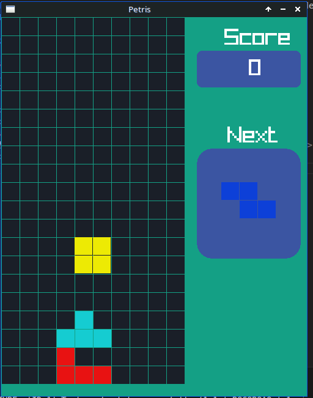

# Tetris
Raylib C++ demo of Tetris.  Built and tested on Debian Linux 

# How to use this template
1. Double click on the main.code-workspace file. This will open the template in VS Code.
2. From the Explorer Window of VS Code navigate to the src folder and double click on the main.cpp file.
3. Press F5 on the keyboard to compile and run the game.

# Video Tutorial

  

 
 

| 🌍 <a href="http://www.petermilne.co.uk">My Website</a> |  

